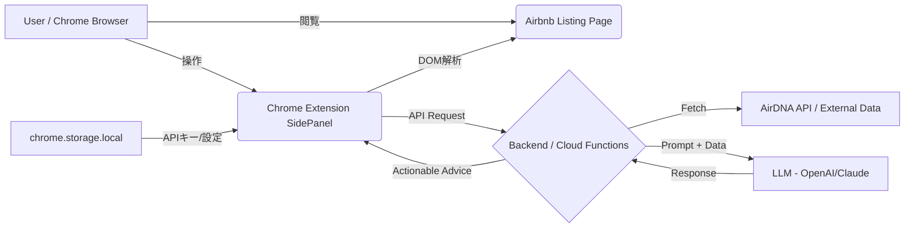

# プロダクト仕様書 (PRD): Airbnb AI Host Assistant

**バージョン**: 2.0 (Draft)
**プラットフォーム**: Google Chrome Extension (Manifest V3)
**更新日**: 2025-11-20

---

## 1. プロダクト概要

### 1.1 コンセプト
Airbnbの物件詳細ページを閲覧するだけで、サイドバーに常駐するAIが「地域相場」「競合データ」「AirDNA等の外部データ」を統合し、**「今の価格設定の妥当性」と「収益向上のための具体的な改善策」**を自然言語でアドバイスするChrome拡張機能。

### 1.2 解決する課題
*   **データの断絶**: ホストはAirbnbの画面と、AirDNAなどの分析ツールを行き来しており、情報の突き合わせが面倒。
*   **分析の属人化**: データを見ても「結局いくらに設定すべきか」「文章をどう直すべきか」の判断が難しい。
*   **時間コスト**: 競合調査や説明文の推敲に多くの時間を費やしている。

### 1.3 ターゲットユーザー
*   **個人・副業ホスト**: 1〜3物件を運用。データ分析よりゲスト対応を優先したい層。
*   **小規模運営代行（〜10室）**: 効率的に複数物件のパフォーマンスを底上げしたい事業者。
*   **AirDNA契約者**: データを持て余しており、具体的なアクションプランを求めている層。

### 1.4 成功指標 (KPI)
*   **導入率**: インストール後7日以内のアクティブ利用率 > 60%
*   **利用頻度**: 週次平均利用回数 > 3回/ユーザー
*   **価値実感**: ユーザーアンケートでの「収益向上に役立った」評価 > 4.0/5.0
*   **リテンション**: 30日後継続利用率 > 50%

---

## 2. ユースケース・ユーザーフロー

### 2.1 基本フロー（新規物件の価格設定）
1. **トリガー**: ホストが自分の物件ページ（`airbnb.jp/rooms/123456`）をChromeで開く
2. **自動起動**: 拡張機能がURLを検知し、Side Panelに分析アイコンが表示される
3. **Side Panel展開**: ユーザーがアイコンクリック → AIが物件データを自動抽出
4. **市場データ表示**: 3秒以内にエリアADR、稼働率、RevPARを表示
5. **AI分析実行**: 「分析を開始」ボタンクリック → LLMによる価格提案と改善案が生成（約10秒）
6. **アクション**: ユーザーが提案されたタイトルや価格をコピーし、Airbnb編集画面に反映

### 2.2 セカンダリフロー（競合調査）
1. ユーザーが気になる競合物件ページを開く
2. Side Panelに競合データが表示される
3. 「自物件と比較」ボタンで差分分析を表示
4. 改善アクションアイテムをメモとして保存

---

## 3. システムアーキテクチャ

### 3.1 構成図（概念）


### 3.2 テクニカルスタック
*   **Frontend**: React 18+, TypeScript 5+, Tailwind CSS 3+ (Chrome Extension Side Panel API)
*   **Backend**: Node.js 20+ (Firebase Functions または AWS Lambda) - **MVP Phase では Optional**
*   **Database**: Firestore (ユーザー設定、キャッシュ、分析履歴保存) - **MVP Phase では chrome.storage.local で代替可**
*   **AI Model**: GPT-4o または Claude 3.5 Sonnet (複雑な推論と自然な日本語生成のため)
*   **Data Source**: 
    *   **Primary**: AirDNA API (利用可能な場合)
    *   **Fallback**: DOM スクレイピング + 公開データ（Airbnb検索結果から周辺物件を取得）

### 3.3 技術的制約
*   Manifest V3の制限により、Background ScriptはService Workerとして実装
*   Content Security Policy (CSP) により、inline scriptは使用不可
*   Side Panel APIはChrome 114以降でのみ利用可能（Safari/Firefox未対応）

---

## 4. 機能要件

### 4.1 MVPスコープ（Phase 1 - 初回リリース）

#### 4.1.1 Airbnbページ認識・データ抽出 ★ Core Feature
*   **優先度**: P0（必須）
*   **トリガー**: URLが `airbnb.com/rooms/{id}` または `airbnb.jp/rooms/{id}` に一致した場合にアクティブ化。
*   **実装方法**: 
    *   Content Scriptで `window.__NEXT_DATA__` または `window.__ROUTE_DATA__` のJSON objectを取得
    *   フォールバック: DOMセレクタで主要要素をスクレイピング
*   **抽出データ**:
    *   物件ID (room_id) - `必須`
    *   物件タイトル - `必須`
    *   ホスト名・スーパーホストフラグ - `任意`
    *   宿泊料金 (Base Price / Cleaning Fee) - `必須`
    *   最大定員・ベッド数・バスルーム数 - `必須`
    *   位置情報 (Lat/Lon) - `必須（市場データ取得に必要）`
    *   レビュー平均点・件数 - `必須`
    *   説明文 (Description) - `必須`
    *   アメニティリスト - `任意`
*   **エラーハンドリング**: データ取得失敗時は「データを取得できませんでした」と表示し、手動リトライボタンを提供

#### 4.1.2 AI価格コンサルタント ★ Core Feature
*   **優先度**: P0（必須）
*   **入力**: 現在設定価格、物件スペック、位置情報
*   **出力UI**:
    *   **判定バッジ**: 「適正」「割高」「割安」の3段階評価
    *   **推奨価格レンジ**: 単一の推奨価格帯を提示（平日/週末の区別はPhase 2）
    *   **アドバイス理由**: 100〜200文字の自然言語解説
*   **実装**: 
    *   LLMへのプロンプト設計（few-shot examplesを含む）
    *   レスポンスを構造化JSON形式で受け取る

#### 4.1.3 物件改善アドバイザー（簡易版）
*   **優先度**: P1（重要だがリリースに必須ではない）
*   **タイトル改善**: ターゲット別3案の提示（ファミリー、リモートワーク、カップル）
*   **説明文リライト**: 冒頭文のみ生成（全文リライトはPhase 2）
*   **コピー機能**: ワンクリックでクリップボードにコピー

#### 4.1.4 設定画面
*   **優先度**: P0（必須）
*   **設定項目**:
    *   OpenAI/Claude APIキー入力（暗号化せず `chrome.storage.local` に保存 - MVPのみ）
    *   利用規約・プライバシーポリシーへの同意チェックボックス
*   **バリデーション**: APIキー形式チェック（正規表現）

---

### 4.2 将来スコープ（Phase 2以降）

#### 4.2.1 地域相場ダッシュボード
*   **延期理由**: AirDNA APIへの依存が高く、代替データソースの確保が必要
*   **表示項目**: エリアADR、稼働率、RevPAR
*   **実装予定**: AirDNA契約またはスクレイピング基盤構築後

#### 4.2.2 競合比較ビュー
*   **延期理由**: 複数物件データの収集・整形にコストがかかる
*   **対象**: 同エリア・同価格帯の3〜5件
*   **実装予定**: Phase 2

#### 4.2.3 マルチ物件管理 & ダッシュボード
*   拡張機能のポップアップ外（フルページタブ）で、登録全物件の「AIスコア」を一覧表示。
*   物件ごとの課題をTODOリスト化。

#### 4.2.4 レポート出力
*   「月次運用レポート」をPDF/Markdownでワンクリック生成。
*   オーナーへの報告業務を効率化したい運営代行会社向け機能。

#### 4.2.5 アラート通知 (Background Worker)
*   ブラウザを閉じていてもバックグラウンドでデータを監視。
*   「周辺の予約が急増しています（イベント検知）。価格を上げてください」と通知を送る。

#### 4.2.6 写真AI解析 (Computer Vision)
*   GPT-4o Vision等のAPIを利用。
*   「トップ画像が暗い」「水回りの写真がない」などの具体的な改善点を指摘。
*   クリックされやすい写真の並び順を提案。

---

## 5. 非機能要件

### 5.1 パフォーマンス
*   **初回データ取得**: 3秒以内にDOM解析完了
*   **AI分析**: 15秒以内にLLMレスポンス取得（タイムアウト: 30秒）
*   **UI描画**: Side Panel展開後1秒以内に初期UIを表示（スケルトンスクリーン）

### 5.2 可用性・エラーハンドリング
*   **API障害時**: フォールバック処理（キャッシュデータ表示 or エラーメッセージ）
*   **DOM構造変更**: Airbnbのページ構造変更を検知し、管理者に通知
*   **ネットワークエラー**: リトライロジック（最大3回、exponential backoff）

### 5.3 セキュリティ
*   **APIキー管理**: 
    *   **MVP**: `chrome.storage.local` に平文保存（ユーザー責任で管理）
    *   **Phase 2**: Backend Proxy経由でAPIキーを管理（拡張機能にはキーを保存しない）
*   **個人情報保護**: ゲストの氏名や詳細な住所など、分析に不要なPII（個人特定情報）はバックエンドに送信しない。
*   **通信**: すべてのAPI通信をHTTPS経由で実施

### 5.4 ユーザビリティ
*   **多言語対応**: 日本語のみ（Phase 1）、英語・中国語はPhase 2
*   **レスポンシブUI**: Side Panelの幅に応じてレイアウト調整（最小幅: 320px）
*   **アクセシビリティ**: WCAG 2.1 Level A準拠（キーボード操作、スクリーンリーダー対応）

---

## 6. UX/UI ガイドライン

### 6.1 サイドバー (Side Panel)
*   **幅**: 可変（デフォルト400px、最小320px、最大600px）
*   **トーン & マナー**: AirbnbのUIに馴染むクリーンなデザイン
    *   白背景（#FFFFFF）
    *   フォント: システムフォント優先（-apple-system, BlinkMacSystemFont, "Segoe UI", Roboto）
    *   アクセントカラー: Airbnbラッシュ（#FF385C）または信頼感のある青（#0073E6）
*   **インタラクション**:
    *   AI生成中はスケルトンスクリーンまたはローディングアニメーションを表示
    *   提案されたタイトルや説明文には「コピー」ボタンを配置
    *   Hover時のマイクロインタラクション（ボタンの色変化、影）

### 6.2 設定画面
*   **配置**: Side Panel下部の「設定」アイコンからモーダルで表示
*   **必須項目**: 
    *   OpenAI/Claude APIキー入力フォーム
    *   利用規約同意チェックボックス
*   **任意項目（Phase 2）**:
    *   分析対象エリアの半径設定（500m, 1km, 2km）
    *   言語設定（日本語/英語）

### 6.3 デザインモックアップ要件
*   Side Panelのワイヤーフレーム作成
*   主要3画面: 
    1. 初期状態（データ取得中）
    2. 分析結果表示
    3. 設定画面

---

## 7. データフローとセキュリティ

### 7.1 データフロー（MVP Phase）
```
1. User opens Airbnb listing page
2. Content Script extracts listing data from DOM/JSON
3. Content Script sends data to Side Panel (via chrome.runtime.sendMessage)
4. Side Panel retrieves API key from chrome.storage.local
5. Side Panel calls OpenAI/Claude API directly (HTTPS)
6. LLM response is parsed and rendered in UI
7. User interactions (copy, save) are logged locally
```

### 7.2 データフロー（Phase 2 - Backend導入後）
```
1. User opens Airbnb listing page
2. Content Script extracts listing data
3. Side Panel sends data to Backend (Firebase Functions)
4. Backend fetches market data from AirDNA API
5. Backend calls LLM with combined data
6. Backend returns structured response to Side Panel
7. Side Panel renders UI and stores result in Firestore (for history)
```

### 7.3 セキュリティ要件
*   **認証**: Phase 1ではAPIキーのみ、Phase 2でFirebase Authenticationを導入
*   **データ保持期間**: ローカルキャッシュは7日で自動削除
*   **プライバシー**: 
    *   物件データは一時的にのみ保存（永続化しない）
    *   ユーザーの閲覧履歴は収集しない
    *   Google Analyticsなどのトラッキングは同意取得後のみ有効化

---

## 8. 技術的実装詳細

### 8.1 DOM抽出戦略
1. **優先順位1**: `window.__NEXT_DATA__` または `window.__ROUTE_DATA__` からJSON取得
2. **優先順位2**: `<script type="application/ld+json">` から構造化データ取得
3. **フォールバック**: CSSセレクタでDOM要素をスクレイピング
    ```typescript
    const title = document.querySelector('h1[data-section-id="title"]')?.textContent;
    const price = document.querySelector('[data-plugin-in-point-id="PRICE_STRING"]')?.textContent;
    ```

### 8.2 LLMプロンプト設計例
```
あなたはAirbnbホスト向けのAIコンサルタントです。
以下の物件データを分析し、価格設定の妥当性を評価してください。

【物件データ】
- タイトル: {title}
- 価格: {price}円/泊
- 定員: {capacity}名
- 位置: {location}
- レビュー: {rating} ({review_count}件)

【分析指示】
1. 現在の価格が適正か評価（適正/割高/割安）
2. 推奨価格レンジを提示
3. 100文字程度で理由を説明

【回答形式】JSON
{
  "judgment": "適正" | "割高" | "割安",
  "recommended_price_min": number,
  "recommended_price_max": number,
  "reason": "string"
}
```

### 8.3 エラーハンドリング設計
| エラー種別 | 対応方法 |
|-----------|---------|
| DOM解析失敗 | 3回リトライ → エラーメッセージ表示 |
| API Rate Limit | Exponential backoff → 「APIリクエスト上限に達しました。しばらく待ってください」 |
| LLMタイムアウト | 30秒でタイムアウト → 「分析に時間がかかっています。再試行してください」 |
| 不正なAPIキー | 「APIキーが無効です。設定を確認してください」 |

---

## 9. 開発・リリース計画

### 9.1 マイルストーン
| Phase | 期間 | 主要機能 | ゴール |
|-------|------|---------|--------|
| Phase 0 | Week 1-2 | プロジェクトセットアップ、基本UI | Side Panel表示 |
| Phase 1 | Week 3-4 | DOM抽出、LLM統合 | AI価格提案動作 |
| Phase 2 | Week 5-6 | 改善アドバイザー、設定画面 | MVP完成 |
| Phase 3 | Week 7-8 | テスト、バグ修正、ポリッシュ | リリース候補 |

### 9.2 リリース基準
- [ ] P0機能がすべて動作
- [ ] 主要3ブラウザ（Chrome, Edge, Brave）で動作確認
- [ ] 10名のベータテスターによる実証テスト完了
- [ ] セキュリティレビュー完了
- [ ] Chrome Web Storeのポリシー準拠確認

---

## 10. 制約・リスク

### 10.1 技術的リスク
*   **Airbnb DOM構造の変更**: 定期的な監視と柔軟な抽出ロジックで対応
*   **AirDNA API未契約**: MVP Phase では市場データ表示を postpone
*   **LLM API コスト**: 1リクエスト あたり約$0.05 → ユーザー負担（BYOK方式）

### 10.2 法的・倫理的リスク
*   **Airbnb利用規約**: スクレイピングが規約違反の可能性 → 公開データのみ使用、過度な負荷をかけない
*   **競合情報の扱い**: 競合物件の公開情報のみ使用、私的データは取得しない

### 10.3 ビジネスリスク
*   **類似サービスの存在**: 差別化ポイント（AIアドバイスの質、日本語対応）を明確化
*   **マネタイゼーション**: MVP Phaseは無料提供、Phase 2でプレミアムプラン検討

---

## 付録

### A. 参考資料
*   [Chrome Extension Manifest V3 Guide](https://developer.chrome.com/docs/extensions/mv3/)
*   [Chrome Side Panel API Documentation](https://developer.chrome.com/docs/extensions/reference/sidePanel/)
*   [AirDNA API Documentation](https://developers.airdna.co/)

### B. 用語集
*   **ADR (Average Daily Rate)**: 平均客単価
*   **RevPAR (Revenue Per Available Room)**: 販売可能客室あたり収益
*   **CTR (Click-Through Rate)**: クリック率
*   **CVR (Conversion Rate)**: 成約率
